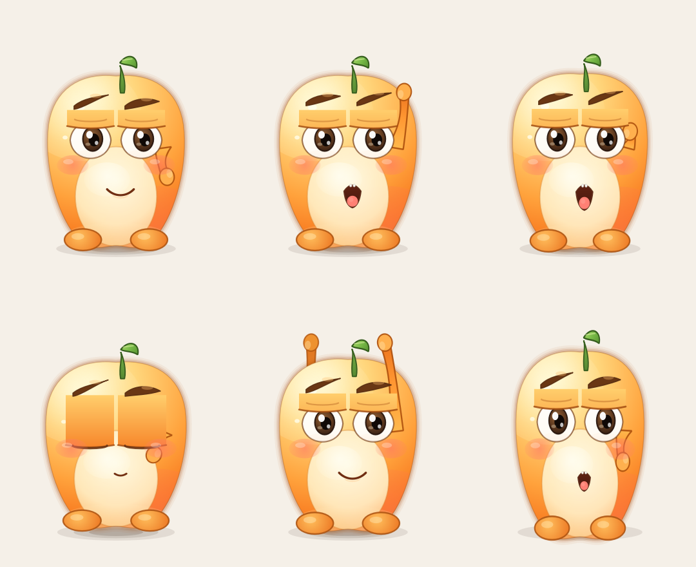

# Momo 桌宠 🍊

一个 Pixar 动画风格的 macOS 桌面宠物：圆滚滚的小橘子怪兽 **Momo**。
它会像真的小家伙一样自己溜达、发呆、打盹、跳舞、要吃的，也会追着你的鼠标看。



## 快速开始

双击 `start.command`（首次会自动创建虚拟环境并安装 PySide6 + pyobjc）。

或者在终端里运行：

```bash
cd 本目录
python3 -m venv .venv
./.venv/bin/pip install -r requirements.txt
./.venv/bin/python pixar_pet.py
```

## 怎么和 Momo 玩

| 操作 | Momo 的反应 |
| --- | --- |
| 单击 | 被戳一下：惊讶、脸红、冒小心心 |
| 双击 | 击掌 + 即兴跳舞 |
| 按住不动 | 抚摸：舒服得冒爱心，心情和亲密度上升 |
| 按住拖动 | 把它拎起来；松手后弹跳落地，扬起灰尘 |
| 鼠标悬停 | 它会一直盯着你的光标看，看久了会挥手打招呼 |
| 滚轮 | 挠痒痒：咯咯笑 |
| 右键 / 托盘右键 | 喂饼干、扔皮球、跳舞、睡觉/叫醒、退出（Momo 永远浮在最上层） |
| 点击托盘图标 | 打招呼（睡着时会被叫醒） |

## 自主行为（像真人一样有需求）

Momo 有四个隐形需求：**饱腹、精力、亲密度、心情**，会随时间变化：

- 🍪 饿了会主动说“肚子咕咕叫”，心情变差 → 右键喂小饼干
- 😴 累了或深夜会自己睡着，睡饱了会醒来；睡着会冒 Zzz
- 🥺 太久没人理会主动招手求关注
- 😄 心情好会自己唱歌、跳舞、散步、发呆、伸懒腰、打哈欠
- 🚶 会沿屏幕底边自己“溜达”，还会东张西望、眨眼、盯着鼠标

需求与窗口位置会保存在 `~/.momo_pet.json`。

## 文件说明

```
pixar_pet.py      主程序（无外部资源，角色全部用 Qt 矢量绘制）
requirements.txt  依赖
start.command     macOS 双击启动脚本
make_preview.py   生成各状态的预览图（可选）
docs/preview.png  预览图
```

## 常见问题

- **没有安装依赖**：双击 `start.command`，它会自动创建虚拟环境并安装依赖。
- **桌宠不见了**：它可能溜达到屏幕另一边，或者在菜单栏托盘里点一下图标。
- **退出**：右键 Momo 或托盘图标 → 退出。
- **它永远在最上层**：Qt 置顶 + macOS 原生 `NSFloatingWindowLevel` 双重保证，跨 Space、全屏 App 之上都会显示。这是设计如此，不提供取消置顶。
- **不会抢焦点**：窗口是 `NonactivatingPanel`，App 运行在 Accessory 模式（不占 Dock、不出现在 Cmd-Tab），点击、拖动 Momo 都不会打断你正在用的软件。

## 技术小抄

- 60 FPS 角色动画：眨眼、呼吸、挤压与拉伸（squash & stretch）、预备动作
- 全矢量 QPainter 渲染：多层径向渐变 + 柔光 + 环境光反射 + 眼睑/虹膜/高光细节，Pixar 大眼风格
- 无边框透明窗口 + QPropertyAnimation 窗口移动
- 置顶：Qt `WindowStaysOnTopHint` + macOS 原生 `NSFloatingWindowLevel`、`CanJoinAllSpaces`、`FullScreenAuxiliary`
- 简单状态机 + 需求系统驱动自主行为
